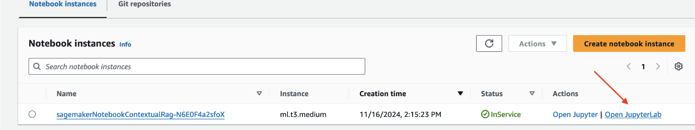

# Contextual Retrieval with Llama-index

In this tutorial, you will learn how to improve the context in your vector store using contextual retrieval with Amazon Bedrock and the Olympus family of models. We will be using Llama-index pipelines to orchestrate and automate the workflow execution.

## Deployment Guide

### Prerequisites

Before you begin, ensure all prerequisites are in place. You should have:

* An AWS account
* The AWS CLI installed and configured with your credentials
* The latest stable version of Node.js and npm installed
* Requested access to amazon.Nova-pro-v1:0 via Bedrock model access

1) Build CDK project

```
npm install -g typescript
mkdir sample-app && cd sample-app
cdk init sample-app --language typescript
```

2) Copy Sample IaC

* navigate into bin/sample-app-stack.ts and add the following code

```
#!/usr/bin/env node
import * as cdk from 'aws-cdk-lib';
import { SampleAppStack } from '../lib/sample-app-stack';

const app = new cdk.App();new SampleAppStack(app, 'SampleAppStack-contextual-rag');
```

* navigate into lib/sample-app-stack.ts, and add the following
```
import * as cdk from "aws-cdk-lib";

import { Duration, Stack, StackProps } from 'aws-cdk-lib';
import { Construct } from 'constructs';

import * as iam from "aws-cdk-lib/aws-iam";
import * as sagemaker from "aws-cdk-lib/aws-sagemaker";

export class SampleAppStack extends Stack {
  constructor(scope: Construct, id: string) {
    super(scope, id);

    /* 
     * IAM
     */

    const iamRoleSagemaker = new iam.Role(this, `iamRoleSagemaker`, {
      assumedBy: new iam.ServicePrincipal("sagemaker.amazonaws.com"),
    });
    iamRoleSagemaker.addManagedPolicy(
      iam.ManagedPolicy.fromAwsManagedPolicyName('AmazonSageMakerFullAccess')
    )
    iamRoleSagemaker.addToPolicy(
      new iam.PolicyStatement({
        effect: iam.Effect.ALLOW,
        resources: [
          "*"
        ],
        actions: [
          "bedrock:*"
        ],
      })
    );

    /* 
     * Sagemaker
     */

    const sagemakerNotebookContextualRag = new sagemaker.CfnNotebookInstance(this, 'sagemakerNotebookContextualRag', {
      instanceType: 'ml.t3.medium',
      roleArn: iamRoleSagemaker.roleArn
    });
  }
}
```
3) Deploy Infra

```
# set your region
export AWS_REGION=us-east-1

# bootstrap cdk (if this is the first time you’re using the account / region with CDK)
cdk bootstrap

# deploy cdk
cdk deploy
```

4) Setup Notebook

Once the CDK completes the deployment, you will find the a Sagemaker Notebook instance in your Sagemaker AWS Console:


If we open the demo code provided in our notebook (notebooks/contextual-retrieval.ipynb), you’ll see an interactive demo that 

* Setup:
    * Install python modules
    * Import required classes/functions
    * Set all static variables
    * Define custom classes/functions required
    * initialize clients (AWS/llama-index)
* Scrape content
    * define web crawler, and specify documents to ingest
    * split documents into chunks (to fit within embedding model constraints)
* Create retriever-basic from content
    * create an ingestion pipeline
    * execute the pipeline
    * save the cache of the pipeline to disk
    * move the pipeline output into an in memory index
    * create a retriever to retrieve documents from the index
* Create retriever-enriched from content
    * create an ingestion pipeline
    * execute the pipeline
    * save the cache of the pipeline to disk
    * move the pipeline output into an in memory index
    * create a retriever to retrieve documents from the index
* Create retriever-enriched-bm25 from content using enriched index, create a BM25 retriever
* Create retriever-enriched-bm25-with-reranker from content using both the enriched retriever AND the BM25 retriever, create a hybrid retriever that also adds re-ranking capabilities
* Generate Testing Data
    * setup asyncio for async processing
    * iterate over split documents, and generate "n" sample questions based on the content
* Evaluate Retriever-original, Retriever-enriched, Retriever-enriched-BM25 and Retriever-enriched-BM25
    * This is where we will iterate over the sample questions for both indexes and assess the performance against a number of metrics
        * hit_rate: This metric represents the percentage of queries where the retriever successfully retrieves at least one relevant document from the knowledge base. A higher hit rate indicates better overall retrieval performance.
        * MRR: Mean Reciprocal Rank (MRR) is one of the metrics that help evaluate the quality of recommendation and information retrieval systems. Simply put, it helps understand the average position of the first relevant item across all user lists.
        * Recall: This evaluates how well the retrieved context matches to the annotated answer, treated as the ground truth. It’s computed based on the ground truth answer and the retrieved context. The values range between 0–1, with higher values indicating better performance.

## Post Activities

Don’t forget to delete all resources created during this tutorial and stop recurring costs, you can do that using the cdk command line:

```
cdk destroy -y
```

